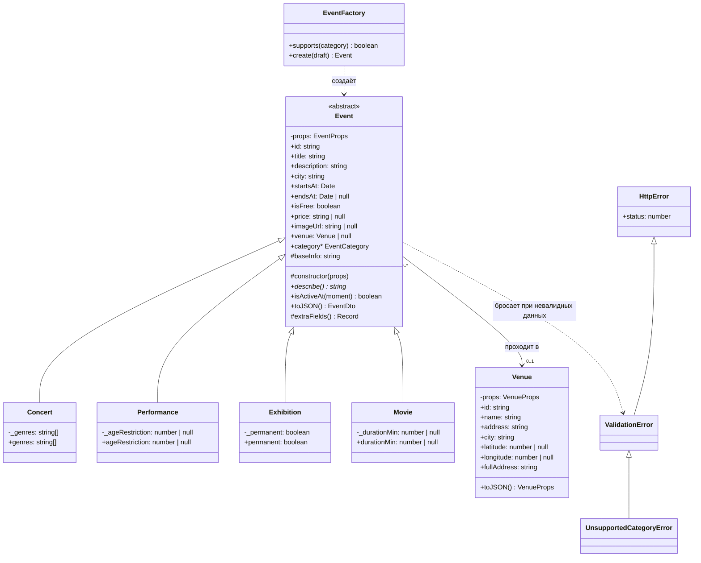

# Диаграмма классов (шаг 2)

`+` — публичные члены, `-` — приватные, `#` — защищённые.

```mermaid
classDiagram
  class Event {
    <<abstract>>
    -props: EventProps
    #constructor(props)
    +id: string
    +title: string
    +description: string
    +city: string
    +startsAt: Date
    +endsAt: Date | null
    +isFree: boolean
    +price: string | null
    +imageUrl: string | null
    +venue: Venue | null
    +category* EventCategory
    +describe()* string
    +isActiveAt(moment) boolean
    +toJSON() EventDto
    #baseInfo: string
    #extraFields() Record
  }
  class Concert {
    -_genres: string[]
    +genres: string[]
  }
  class Performance {
    -_ageRestriction: number | null
    +ageRestriction: number | null
  }
  class Exhibition {
    -_permanent: boolean
    +permanent: boolean
  }
  class Movie {
    -_durationMin: number | null
    +durationMin: number | null
  }
  class Venue {
    -props: VenueProps
    +id: string
    +name: string
    +address: string
    +city: string
    +latitude: number | null
    +longitude: number | null
    +fullAddress: string
    +toJSON() VenueProps
  }
  class EventFactory {
    +supports(category) boolean
    +create(draft) Event
  }
  class HttpError {
    +status: number
  }
  class ValidationError
  class UnsupportedCategoryError

  Event <|-- Concert
  Event <|-- Performance
  Event <|-- Exhibition
  Event <|-- Movie
  Event "0..*" --> "0..1" Venue : проходит в
  EventFactory ..> Event : создаёт
  HttpError <|-- ValidationError
  ValidationError <|-- UnsupportedCategoryError
  Event ..> ValidationError : бросает при невалидных данных
```
